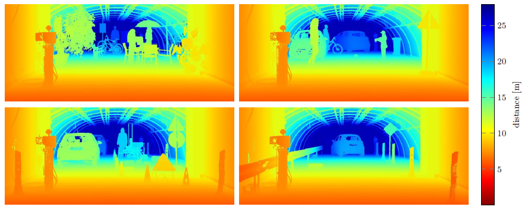
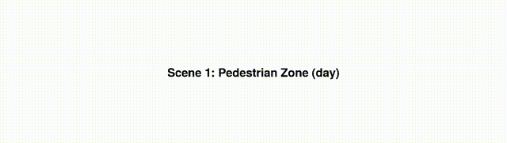
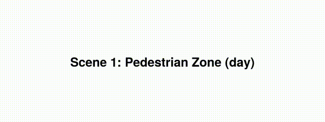
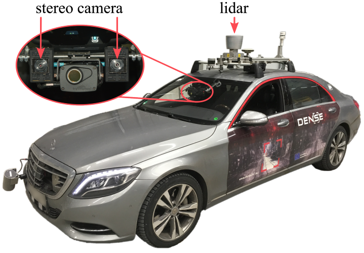

PixelAccurateDepthBenchmark
============================



This repo contains the code and data for [Pixel-Accurate Depth Evaluation in Realistic Driving Scenarios](https://arxiv.org/pdf/1906.08953.pdf) by [Tobias Gruber](https://scholar.google.de/citations?user=w-VeQ5cAAAAJ&hl=de), [Mario Bijelic](http://mariobijelic.de/wordpress/), [Felix Heide](http://www.cs.princeton.edu/~fheide/), [Werner Ritter](https://www.xing.com/profile/Werner_Ritter7) and [Klaus Dietmayer](https://www.uni-ulm.de/en/in/institute-of-measurement-control-and-microtechnology/institute/staff/institutional-administration/prof-dr-ing-klaus-dietmayer/).

NEWS: Coda and data are available now!

# Introduction
This work presents an evaluation benchmark for depth estimation and completion using high-resolution depth measurements with angular resolution of up to 25" (arcsecond), akin to a 50 megapixel camera with per-pixel depth available. Existing datasets, such as the KITTI benchmark, provide only sparse reference measurements with an order of magnitude lower angular resolution - these sparse measurements are treated as ground truth by existing depth estimation methods. We propose an evaluation in four characteristic automotive scenarios recorded in varying weather conditions (day, night, fog, rain). As a result, our benchmark allows to evaluate the robustness of depth sensing methods to adverse weather and different driving conditions. Using the proposed evaluation data, we show that current stereo approaches provide significantly more stable depth estimates than monocular methods and lidar completion in adverse weather.

## Dataset overview


## Some results


# Getting started

Clone the benchmark code.
```
git clone https://github.com/gruberto/PixelAccurateDepthBenchmark.git
cd PixelAccurateDepthBenchmark
```

For running the evaluation and visualization code you need Python with the following packages:
- numpy
- cv2
- matplotlib
- scipy

We provide a conda environment to run our code.
```
conda env create -f environment.yaml
```

Activate conda environment.
```
conda activate PixelAccurateDepthBenchmark
```

Download the benchmark data from the [DENSE dataset webpage](https://www.uni-ulm.de/en/in/driveu/projects/dense-datasets).

Check if you have downloaded all files. Then, you can unzip your downloaded files.
```
bash scripts/unzip.sh <your_download_folder>
```

We provide the results of our paper by running
```
python src/evaluate.py --approach lidar_hdl64_rgb_left
python src/evaluate.py --approach sgm
python src/evaluate.py --approach monodepth
python src/evaluate.py --approach sparse2dense
```

All visualizations including reference RGB, lidar and high-resolution ground truth can be generated by running
```
python src/visualize.py --approach lidar_hdl64_rgb_left
python src/visualize.py --approach sgm
python src/visualize.py --approach monodepth
python src/visualize.py --approach sparse2dense
```

Apply your algorithm on the benchmark data set and save your depth as npz-File in a folder <your_approach>.
```
import numpy as np
np.savez_compressed(depth)
```

Run the quantitative evaluation.
```
python src/evaluate.py --approach <your_approach>
```

Get qualitative visualizations.
```
python src/visualize.py --approach <your_approach>
```

If any special loading of the data is required, adapt the load_depth() function in Evaluator.py.

# Sensor setup


## Load RGB image
The RGB image is already debayered, rectified and transformed to 8bit and can be loaded with:
```
import cv2
cv2.imread('./data/rgb_left_8bit/scene1_day_clear_0.png')
```

## Load lidar
The lidar point clouds are already projected into the RGB camera frame and can be loaded with:
```
import numpy as np
np.load('./data/lidar_hdl64_rgb_left/scene1_day_clear_0.npz')['arr_0']
```

## Load high-resolution ground truth
The high-resolution ground truth is provided for each scenario and can be loaded with:
```
import numpy as np
np.load('./data/intermetric_rgb_left/scene1.npz')['arr_0']
```

# Model finetuning

See [Gated2Depth](https://github.com/gruberto/Gated2Depth) for finetuning your models to our sensor setup.

# Reference
If you find our work on benchmarking depth algorithms useful in your research, please consider citing our paper:
```
@inproceedings{depthbenchmark2019,
  title     = {Pixel-Accurate Depth Evaluation in Realistic Driving Scenarios},
  author    = {Gruber, Tobias and Bijelic, Mario and Heide, Felix and Ritter, Werner and Dietmayer, Klaus},
  booktitle = {International Conference on 3D Vision (3DV)},
  year      = {2019}
}
```

# Acknowledgements
This work has received funding from the European Union under the H2020 ECSEL Programme as part of the DENSE project, contract number 692449.
